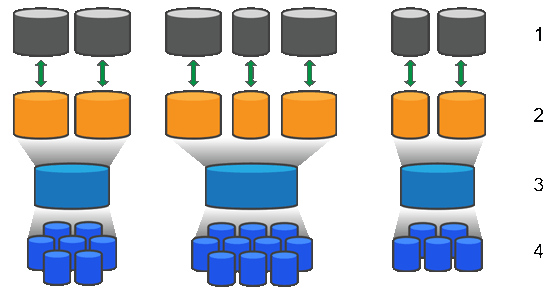

= Funktionsweise von Pools und Volumengruppen in SANtricity software
:allow-uri-read: 
:icons: font
:imagesdir: ../media/

[role="lead"]
Um Speicher bereitzustellen, erstellen Sie entweder einen Pool oder eine Volumengruppe, die die Hard Disk Drives (HDD) oder Solid State Disk (SSD) Laufwerke enthält, die Sie in Ihrem Storage-Array verwenden möchten.

Die physische Hardware wird in logische Komponenten unterteilt, damit Daten organisiert und leicht abgerufen werden können. Es werden zwei Arten von Gruppierungen unterstützt:

* Pools
* RAID-Volumegruppen

Pools und Volume-Gruppen sind die obersten Speichereinheiten eines Storage-Arrays: Sie unterteilen die Kapazität der Laufwerke in überschaubare Einheiten. Innerhalb dieser logischen Einheiten befinden sich die einzelnen Volumes oder LUNs, in denen Daten gespeichert werden. Die folgende Abbildung veranschaulicht dieses Konzept.

^1^ Host-LUNs; ^2^ Volumes; ^3^ Volume groups oder Pools; ^4^ HDD oder SSD drives

Bei der Bereitstellung eines Speichersystems besteht der erste Schritt darin, den verschiedenen Hosts die verfügbare Laufwerkskapazität zu präsentieren durch:

* Erstellen von Pools oder Volumengruppen mit ausreichender Kapazität
* Hinzufügen der Anzahl an Laufwerken, die zur Erfüllung der Leistungsanforderungen erforderlich sind, zum Pool oder zur Volume-Gruppe
* Auswahl des gewünschten RAID-Schutzniveaus (bei Verwendung von Volumengruppen) zur Erfüllung spezifischer Geschäftsanforderungen

Sie können Pools oder Volumengruppen auf demselben Speichersystem haben, aber ein Laufwerk kann nicht Teil von mehr als einem Pool oder einer Volumengruppe sein. Volumen, die Hosts für I/O zur Verfügung gestellt werden, werden dann unter Verwendung des Speicherplatzes im Pool oder in der Volumengruppe erstellt.

== Pools

Pools dienen dazu, physische Festplatten zu einem großen Speicherbereich zusammenzufassen und diesen mit erweitertem RAID-Schutz zu versehen. Ein Pool erstellt aus der Gesamtzahl der dem Pool zugewiesenen Festplatten zahlreiche virtuelle RAID-Sets und verteilt die Daten gleichmäßig auf alle beteiligten Festplatten. Fällt eine Festplatte aus oder wird eine hinzugefügt, gleicht System Manager die Daten dynamisch auf alle aktiven Festplatten aus.

Pools fungieren als zusätzliche RAID-Ebene und virtualisieren die zugrundeliegende RAID-Architektur, um Leistung und Flexibilität bei Aufgaben wie Wiederherstellung, Laufwerkserweiterung und Umgang mit Laufwerksausfall zu optimieren. System Manager stellt die RAID-Ebene automatisch auf 6 in einer 8+2-Konfiguration (acht Datenträger plus zwei Paritätslaufwerke) ein.

=== Laufwerksübereinstimmung

Sie können für die Verwendung in Pools entweder HDDs oder SSDs auswählen; jedoch müssen, wie bei Volumengruppen, alle Laufwerke im Pool dieselbe Technologie verwenden. Die Controller wählen automatisch aus, welche Laufwerke eingeschlossen werden, daher müssen Sie sicherstellen, dass Sie über eine ausreichende Anzahl von Laufwerken für die von Ihnen gewählte Technologie verfügen.

=== Verwaltung ausgefallener Laufwerke

Pools verfügen über eine Mindestkapazität von 11 Laufwerken; allerdings ist die Kapazität eines Laufwerks als Reservekapazität für den Fall eines Laufwerksausfalls reserviert. Diese Reservekapazität wird als "`preservation capacity.`" bezeichnet.

Beim Erstellen von Pools wird eine bestimmte Kapazität für Notfälle reserviert. Diese Kapazität wird im System Manager in Form einer Anzahl von Laufwerken angegeben, aber die tatsächliche Implementierung erstreckt sich über den gesamten Laufwerkspool. Die standardmäßig reservierte Kapazität basiert auf der Anzahl der Laufwerke im Pool.

Nachdem der Pool erstellt wurde, können Sie den Wert der Erhaltungskapazität auf mehr oder weniger Kapazität ändern oder sogar auf keine Erhaltungskapazität (im Wert von 0 Laufwerken) setzen. Die maximale Menge an Kapazität, die erhalten werden kann (ausgedrückt als Anzahl der Laufwerke), beträgt 10, aber die verfügbare Kapazität kann geringer sein, abhängig von der Gesamtzahl der Laufwerke im Pool.

== Volume-Gruppen

Volume-Gruppen definieren, wie die Kapazität im Speichersystem Volumes zugeteilt wird. Festplatten werden in RAID-Gruppen organisiert und Volumes befinden sich über die Festplatten in einer RAID-Gruppe verteilt. Daher geben die Konfigurationseinstellungen der Volume-Gruppe an, welche Festplatten Teil der Gruppe sind und welches RAID-Level verwendet wird.

Beim Erstellen einer Volume-Gruppe wählen die Controller die in die Gruppe aufzunehmenden Laufwerke automatisch aus. Sie müssen den RAID-Level für die Gruppe manuell festlegen. Die Kapazität der Volume-Gruppe ist die Gesamtzahl der von Ihnen ausgewählten Laufwerke, multipliziert mit deren Kapazität.

=== Laufwerksübereinstimmung

Die Laufwerke in der Volume-Gruppe müssen hinsichtlich Größe und Leistung aufeinander abgestimmt sein. Wenn kleinere und größere Laufwerke in der Volume-Gruppe vorhanden sind, werden alle Laufwerke als die mit der kleinsten Kapazität erkannt. Wenn langsamere und schnellere Laufwerke in der Volume-Gruppe vorhanden sind, werden alle Laufwerke mit der langsamsten Geschwindigkeit erkannt. Diese Faktoren beeinflussen die Leistung und die Gesamtkapazität des Speichersystems.

Unterschiedliche Laufwerkstechnologien (HDD und SSD) können nicht kombiniert werden. RAID 3, 5 und 6 sind auf maximal 30 Laufwerke beschränkt. RAID 1 und RAID 10 verwenden Spiegelung, daher müssen diese Volume-Gruppen eine gerade Anzahl von Festplatten aufweisen.

=== Verwaltung ausgefallener Laufwerke

Volume-Gruppen verwenden Hot-Spare-Laufwerke als Standby, falls ein Laufwerk in RAID 1/10-, RAID 3-, RAID 5- oder RAID 6-Volumes innerhalb einer Volume-Gruppe ausfällt. Ein Hot-Spare-Laufwerk enthält keine Daten und bietet eine zusätzliche Redundanzebene für Ihr Storage-Array.

Fällt ein Laufwerk im Storage-Array aus, wird das Hot-Spare-Laufwerk automatisch für das ausgefallene Laufwerk eingesetzt, ohne dass ein physischer Austausch erforderlich ist. Wenn das Hot-Spare-Laufwerk verfügbar ist, wenn ein Laufwerk ausfällt, verwendet der Controller Redundanzdaten, um die Daten vom ausgefallenen Laufwerk auf das Hot-Spare-Laufwerk zu rekonstruieren.
