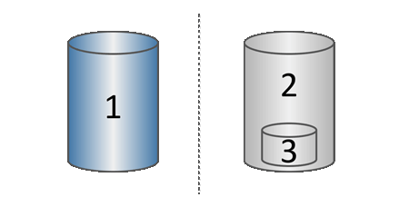

= Wie die Snapshot-Speicherung in SANtricity-Software funktioniert
:allow-uri-read: 
:icons: font
:imagesdir: ../media/

[role="lead"]
Die Snapshot-Funktion verwendet die Copy-on-Write-Technologie, um Snapshot-Bilder zu speichern und die zugewiesene reservierte Kapazität zu nutzen.

== Wie Snapshot-Images verwendet werden

Ein Snapshot-Image ist eine logische, schreibgeschützte Kopie des Volume-Inhalts, die zu einem bestimmten Zeitpunkt erfasst wird. Sie können Snapshots zum Schutz vor Datenverlust verwenden.

Snapshot-Images sind auch für Testumgebungen nützlich. Durch das Erstellen einer virtuellen Kopie von Daten können Sie Daten mithilfe des Snapshots testen, ohne das eigentliche Volume zu verändern. Da Hosts zudem keinen Schreibzugriff auf Snapshot-Images haben, stellen Ihre Snapshots stets eine sichere Backup-Ressource dar.

== Snapshot-Erstellung

Wenn Snapshots erstellt werden, speichert die Snapshots-Funktion die Bilddaten wie folgt:

* Wenn ein Snapshot-Image erstellt wird, entspricht es exakt dem Basisvolume. Die Snapshots-Funktion verwendet Copy-on-Write-Technologie. Nachdem der Snapshot erstellt wurde, führt der erste Schreibvorgang auf einen beliebigen Block oder eine Gruppe von Blöcken des Basisvolumes dazu, dass die Originaldaten in den reservierten Speicher kopiert werden, bevor die neuen Daten auf das Basisvolume geschrieben werden.
* Nachfolgende Snapshots enthalten nur geänderte Datenblöcke. Bevor Daten auf dem Basisvolume überschrieben werden, verwendet die Snapshot-Funktion ihre Copy-on-Write-Technologie, um die benötigten Abbilder der betroffenen Sektoren im für Snapshots reservierten Speicherbereich zu speichern.
+

^1^ Basisvolume (physische Festplattenkapazität); ^2^ Snapshots (logische Festplattenkapazität); ^3^ Reservierte Kapazität (physische Festplattenkapazität)

* Die reservierte Kapazität speichert Originaldatenblöcke für Teile des Basisvolumes, die sich nach der Erstellung des Snapshots geändert haben, und enthält einen Index zur Nachverfolgung von Änderungen. Im Allgemeinen beträgt die Größe der reservierten Kapazität standardmäßig 40 Prozent des Basisvolumes. (Wenn Sie mehr reservierte Kapazität benötigen, können Sie die reservierte Kapazität erhöhen.)
* Snapshot-Images werden anhand ihres Zeitstempels in einer bestimmten Reihenfolge gespeichert. Nur das älteste Snapshot-Image eines Basisvolumes ist für die manuelle Löschung verfügbar.

== Snapshot-Wiederherstellung

Um Daten auf ein Basisvolume wiederherzustellen, können Sie entweder ein Snapshot-Volume oder ein Snapshot-Image verwenden:

* *Snapshot-Volume* -- Wenn Sie gelöschte Dateien wiederherstellen müssen, erstellen Sie ein Snapshot-Volume aus einem bekannten, funktionierenden Snapshot-Image und weisen Sie es dann dem Host zu.
* *Snapshot-Image* -- Wenn Sie ein Basisvolume auf einen bestimmten Zeitpunkt zurücksetzen müssen, verwenden Sie ein vorheriges Snapshot-Image, um die Daten auf das Basisvolume zurückzusetzen.

