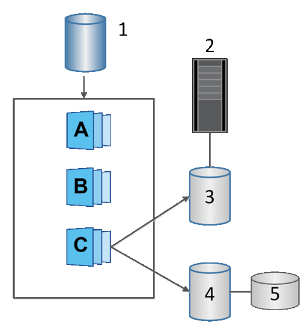

= Erfahren Sie mehr über Snapshot-Volumes in SANtricity Software
:allow-uri-read: 
:icons: font
:imagesdir: ../media/

[role="lead"]
Sie können ein Snapshot-Volume erstellen und es einem Host zuweisen, wenn Sie Snapshot-Daten lesen oder schreiben möchten. Das Snapshot-Volume besitzt dieselben Eigenschaften wie das Basis-Volume (RAID-Level, I/O-Eigenschaften usw.).

Beim Erstellen eines Snapshot-Volumes können Sie es als __read-only__ oder _read-write accessible_ kennzeichnen.

Beim Erstellen von schreibgeschützten Snapshot-Volumes ist keine reservierte Kapazität erforderlich. Beim Erstellen von Lese-/Schreib-Snapshot-Volumes muss reservierte Kapazität hinzugefügt werden, um Schreibzugriff zu ermöglichen.

^1^ Basis-Volume; ^2^ Host; ^3^ Schreibgeschütztes Snapshot-Volume; ^4^ Lese-/Schreib-Snapshot-Volume; ^5^ Reservierte Kapazität
