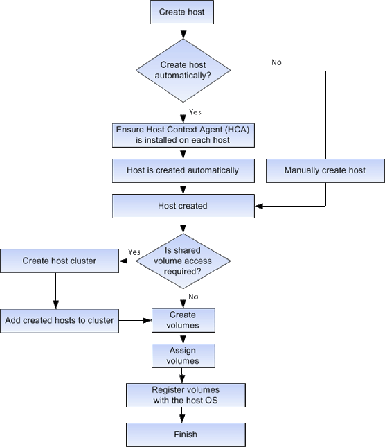

= Wie die Host-Erstellung und die Volume-Zuweisung im SANtricity System Manager funktionieren
:allow-uri-read: 
:icons: font
:imagesdir: ../media/

[role="lead"]
Die folgende Abbildung veranschaulicht, wie der Hostzugriff konfiguriert wird.

