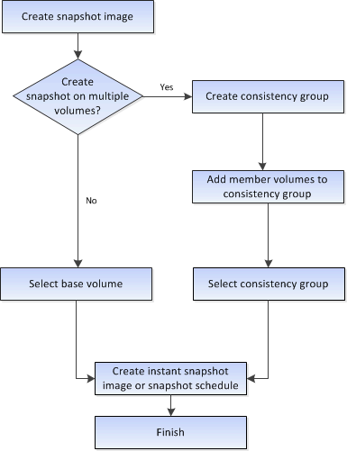

= Wie das Erstellen von Snapshot-Images und Snapshot-Volumes im SANtricity System Manager funktioniert
:allow-uri-read: 
:icons: font
:imagesdir: ../media/

[role="lead"]
Im SANtricity System Manager können Sie Snapshot-Images und Snapshot-Volumes erstellen, indem Sie die folgenden Schritte ausführen.

== Workflow zum Erstellen von Snapshot-Bildern

== Workflow zum Erstellen von Snapshot-Volumes

image::../media/sam1130-flw-snapshots-create-ss-volumes.gif[Workflow zum Erstellen von Snapshot-Volumes]
