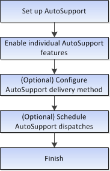

= Konfigurieren Sie AutoSupport im SANtricity System Manager
:allow-uri-read: 
:icons: font
:imagesdir: ../media/

[role="lead"]
Im SANtricity System Manager konfigurieren Sie die AutoSupport-Funktion, indem Sie die folgenden Schritte befolgen.

